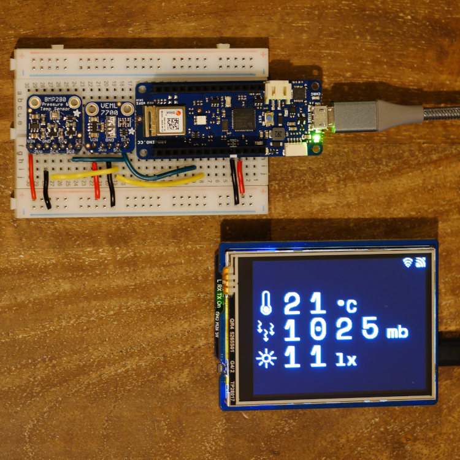
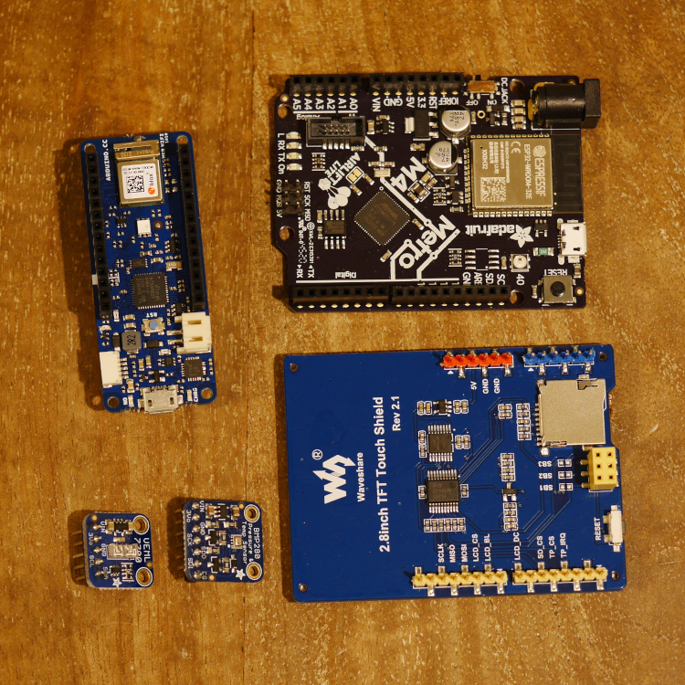
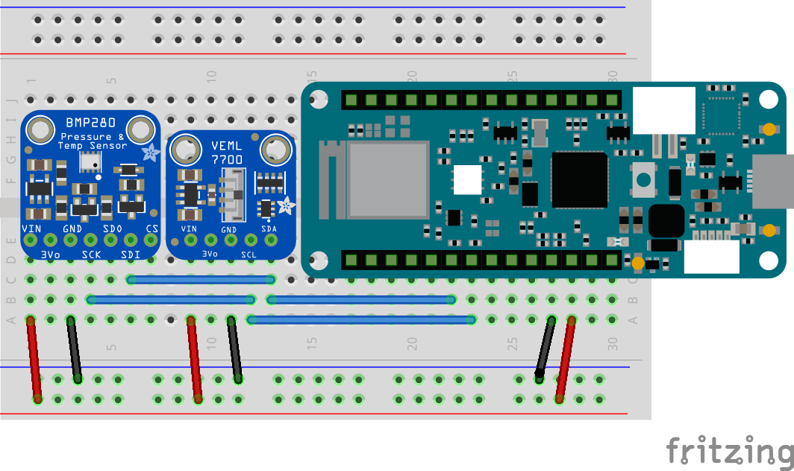

# Remote Temperature Sensor Over MQTT

This project publishes sensor data over WiFi and MQTT, a remote display then shows the values.
The sensors it is using are the BMP280 for temperature and biometric pressure, and the VEML7700 for light data.
The display subscribes to the sensors MQTT topic and updates when a new value is received.

Project components:

---

Temperature Sensor
==================

The Arduino sketch is under the 'sensor' folder.

### Parts

* Arduino MKR WiFi 1010
* Adafruit BMP280 Sensor
* Adafruit VEML7700 Sensor

### Wiring

Connect the sensors power and I2C lines to the Arduino as in the diagram below.

### Libraries

* ArduinoMqttClient
* WiFiNINA (Adafruit version)
* Adafruit_BMP280
* Adafruit_VEML7700

---

Display
=======

The Arduino sketch is under the 'display' folder.

### Parts

* Adafruit Metro M4 Express AirLift Lite
* Waveshare 2.8" TFT Touch Shield

### Wiring

No wiring is needed, the TFT shield fits on top of the Metro.

### Libraries

* ArduinoMqttClient
* WiFiNINA (Adafruit version)
* ArduinoJson
* [Waveshare LCD](https://www.waveshare.com/wiki/2.8inch_TFT_Touch_Shield)
